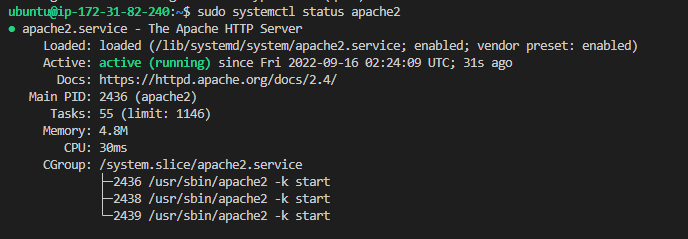
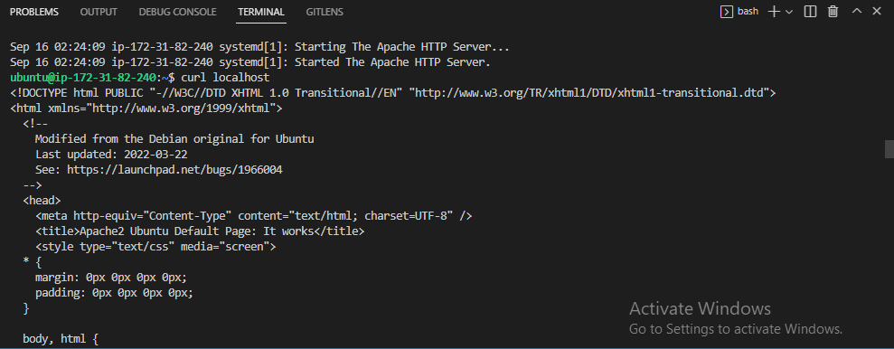
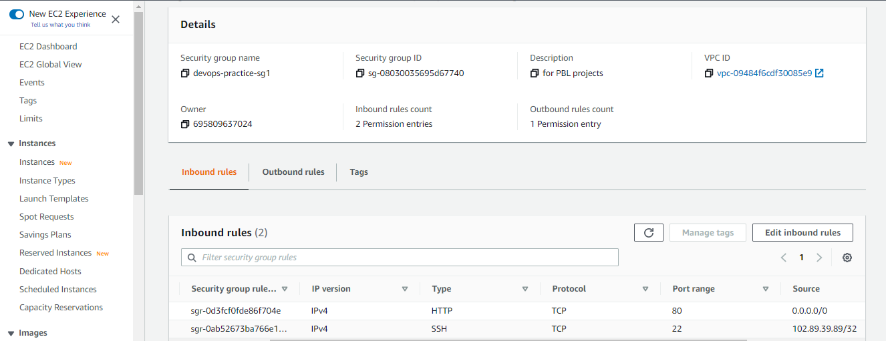
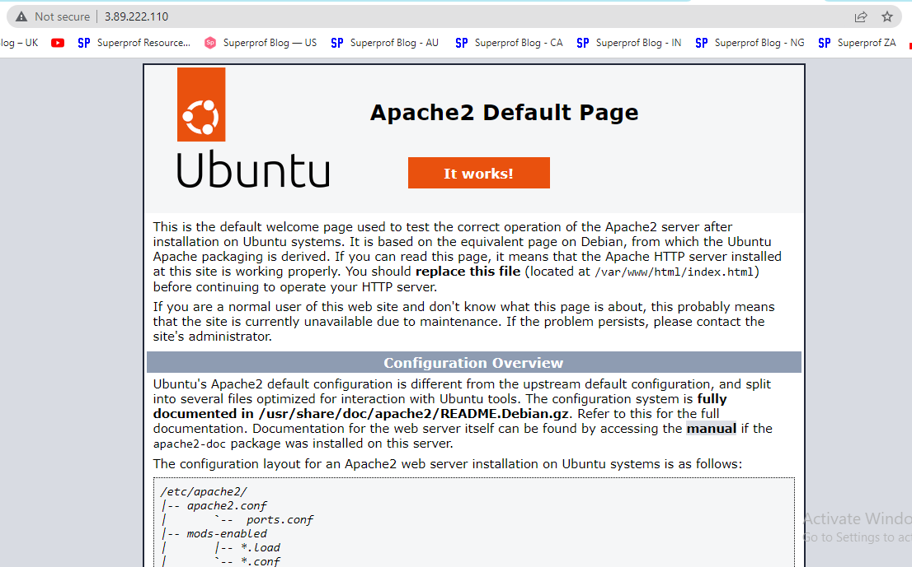
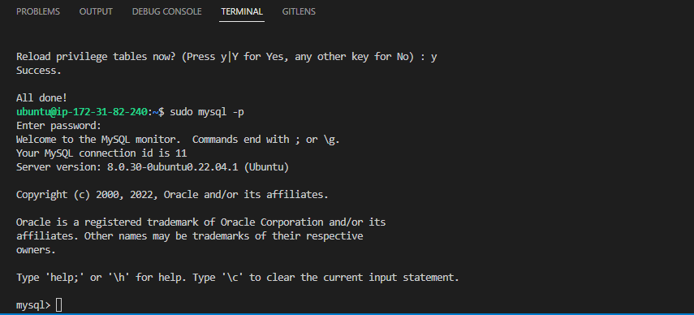
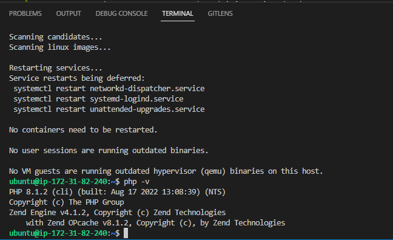
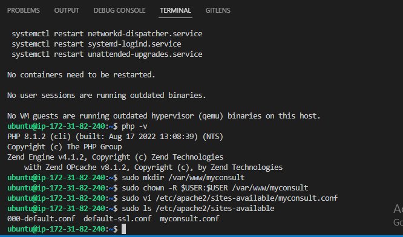
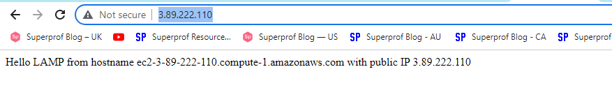
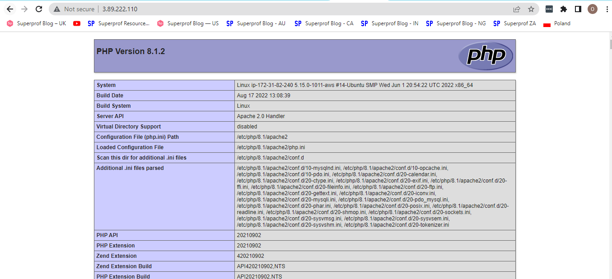

## LAMP STACK IMPLEMENTATION
To ensure a successful completion of this project, here are some prerequisites:
- Have VS Code and some of it's extensions installed.
- Create AWS account and launch an EC2 Instance
- Create a GitHub account and create a personal access token (PAT)
- Create OpenSSH key pair in your local system and use the public key to create SSH key in GitHub

Below are the steps I followed to implement a LAMP STACK in AWS
### 1.  Install Apache Server and Update the Firewall Rule
- Connect to the EC2 instance
On my local PC, I opened the folder created above and saved the downloaded key from AWS. Then I launched my VS Code, clicked on Terminal and ran the following commands.
```
# Grant permission to access and use the key
sudo chmod 400 devops-practice-key1.pem 

# ssh into the EC2 instance
ssh -i devops-practice-key1.pem ubuntu@ec2-3-89-222-110.compute-1.amazonaws.com
```

- Install Apache server
To install Apache server, I had to update the apt packages first before using it to install Apache. Below are the commands used: 
```
#update a list of packages in package manager
sudo apt update -y

#run apache2 package installation
sudo apt install apache2 -y

#confirm that apache is running
sudo systemctl status apache2
```

**Result screenshot:**
<br />


- Confirm that apache server is rendering from within the EC2 instance
`curl http://localhost:80`


**Result Screenshot:**
<br />


- Update the firewall rules
To enable users to access the web server over the internet, I had to open port 80 (for HTTP traffic) using the AWS console. I created a new inbound rule in the security group attached to the EC2 instance with port 80 open to traffic from anywhere.

**Result Screenshot:**
<br />


- Test if you can access Apache server from the internet
To test, I used the command `curl -s http://169.254.169.254/latest/meta-data/public-ipv4` to obtain the public IP address of my EC2 instance and then navigated to that IP address using the web browser of my local system.

**Result Screenshot:**
<br />


### 2.  Install MySQL Database
I followed the steps below to install and configure MySQL:

- use apt package installer to install MySQL
```
sudo apt install mysql-server -y
```

- Connect to the MySQL server as the administrative database user root
```
sudo mysql
```

- Set password for the system root user
```
ALTER USER 'root'@'localhost' IDENTIFIED WITH mysql_native_password BY 'PassWord.1';
```

- Run a security script that comes pre-installed with MySQL. This script will remove some insecure default settings and lock down access to your database system.
```
sudo mysql_secure_installation
```

- To configure the VALIDATE PASSWORD PLUGIN, select Yes when prompted. If the feature is enabled, passwords which don’t match the specified criteria will be rejected by MySQL with an error.

- Set the MySQL root password.

- Press Y and hit the ENTER key when prompted to change the root password, remove some anonymous users and the test database, disable remote root logins, and load these new rules so that MySQL immediately respects the changes you have made.

- Test logging into the MySQL console
```
sudo mysql -p
```

**Result Screenshot:**
<br />


**Note:** At the time of this writing, the native MySQL PHP library mysqlnd doesn’t support caching_sha2_authentication, the default authentication method for MySQL 8. For that reason, when creating database users for PHP applications on MySQL 8, you’ll need to make sure they’re configured to use mysql_native_password instead.

### 3.  Install PHP
To have PHP working as needed, I had to install these three packages: php, php-mysql, and libapache2-mod-php

- Install the needed packages
```
sudo apt install -y php php-mysql libapache2-mod-php
```

- Confirm complete installation of PHP
```
php -v
```
**Result Screenshot:**<br />


### 4.  Create a Virtual host for my website using Apache
To create a virtual host for my website on Apache, I needed to setup a domain called myconsult.

- Create a directory called myconsult
```
sudo mkdir /var/www/myconsult
```

- Assign ownership of the directory to my current user
```
sudo chown -R $USER:$USER /var/www/myconsult
```

- Create and open a new configuration file in Apache’s sites-available directory
```
sudo vi /etc/apache2/sites-available/myconsult.conf
```

- Paste the following configurations inside the configuration file, save and close.
```
<VirtualHost *:80>
    ServerName myconsult
    ServerAlias www.myconsult 
    ServerAdmin webmaster@localhost
    DocumentRoot /var/www/myconsult
    ErrorLog ${APACHE_LOG_DIR}/error.log
    CustomLog ${APACHE_LOG_DIR}/access.log combined
</VirtualHost>
```

- Confirm that the configuration file was created and saved in the right directory
```
sudo ls /etc/apache2/sites-available
```
**Result Screenshot:**<br />


**Note:** To test Apache without a domain, remove or comment out the options ServerName and ServerAlias by adding a # character in the beginning of each option’s lines. Adding the # character there will tell the program to skip processing the instructions on those lines.

- Enable the new virtual host using the `a2ensite` command
```
sudo a2ensite myconsult
```

- Use the `a2dissite` command to disable default website if you are not using custom domain
```
sudo a2dissite 000-default
```

- To check if the configuration file contains syntax errors, run the command below
```
sudo apache2ctl configtest
```

- Create an index.html file in the root directory of my website '/var/www/myconsult/'
```
sudo echo 'Hello LAMP from hostname' $(curl -s http://169.254.169.254/latest/meta-data/public-hostname) 'with public IP' $(curl -s http://169.254.169.254/latest/meta-data/public-ipv4) > /var/www/myconsult/index.html
```

- Reload Apache for the changes to take effect
```
sudo systemctl reload apache2
```

- Test if everything worked as expected by naviagting to the address: http://3.89.222.110

**Result Screenshot:**<br />



### 5.  Enable PHP on my Website
To enable PHP on my website, I had to create an index.php file in my website root directory and changed the order of preference of the index.html and index.php files in my /etc/apache2/mods-enabled/dir.conf configuration file.

- Create and open an index.php file
```
sudo vi /var/www/myconsult/index.php
```

- Paste the following configuration inside the file, save and close it
```
<?php
phpinfo();
```

- Edit the /etc/apache2/mods-enabled/dir.conf configuration file
```
sudo vim /etc/apache2/mods-enabled/dir.conf
```
```
<IfModule mod_dir.c>
        #Change this:
        #DirectoryIndex index.html index.cgi index.pl index.php index.xhtml index.htm
        #To this:
        DirectoryIndex index.php index.html index.cgi index.pl index.xhtml index.htm
</IfModule>
```

- Reload Apache so that changes would take effect.
```
sudo systemctl reload apache2
```

- Confirm that PHP has been correctly enabled for my website by visting the address: http://3.89.222.110

**Result Screenshot:**<br />


**Note:**Use the command below to remove the index.php file from the website root directory when done, as it exposes key information about the PHP environment.<br />

Credit: [This guide was inspired by Digital Ocean](https://www.digitalocean.com/community/tutorials/how-to-install-linux-apache-mysql-php-lamp-stack-on-ubuntu-20-04#step-3-%E2%80%94-installing-php)


